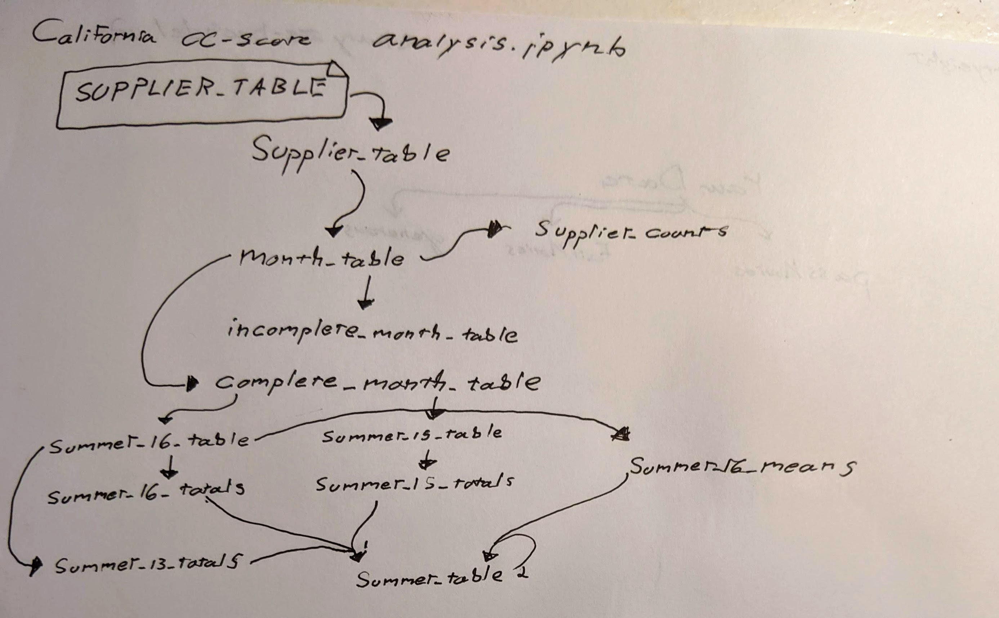

# california-ccscore-analysis

[A Los Angeles Times analysis published on Oct. 31, 2016](http://www.latimes.com/local/lanow/la-me-ln-water-conservation-backslide-20161018-snap-htmlstory.html), found that the overwhelming majority of California water districts increased their usage after the state eased its drought restrictions. Some of the most extreme increases were found in inland Northern California, led by the San Juan Water District near Folsom Lake.

How did The Times come to that conclusion? Using the [Jupyter Notebook](https://github.com/datadesk/california-ccscore-analysis/blob/master/analysis.ipynb) in this repository.

### Steve's Notes

In cell execution 30 and 41, these lines specify an inner join. However, sense all tables have the same set of `supplier_name` values, this operation is essentially an outer join.
```
summer_table = summer_16_totals.merge(summer_15_totals, on="supplier_name")
summer_table = summer_table.merge(summer_13_totals, on="supplier_name")
```

```
summer_table = summer_table.merge(summer_16_means, on="supplier_name")
```



### Running the analysis

Create a virtual environment.

```bash
$ virtualenv california-ccscore-analysis
```

Jump in and activate it.

```bash
$ cd california-ccscore-analysis
$ . bin/activate
```

Clone this repository into a folder called ``repo``.

```bash
$ git clone git@github.com:datadesk/california-ccscore-analysis.git repo
```

Move into the code and install its requirements.

```bash
$ cd repo
$ pip install -r requirements.txt
```

Start up Jupyter Notebook and run the code yourself from your browser.

```
$ jupyter notebook
```

### The print edition


